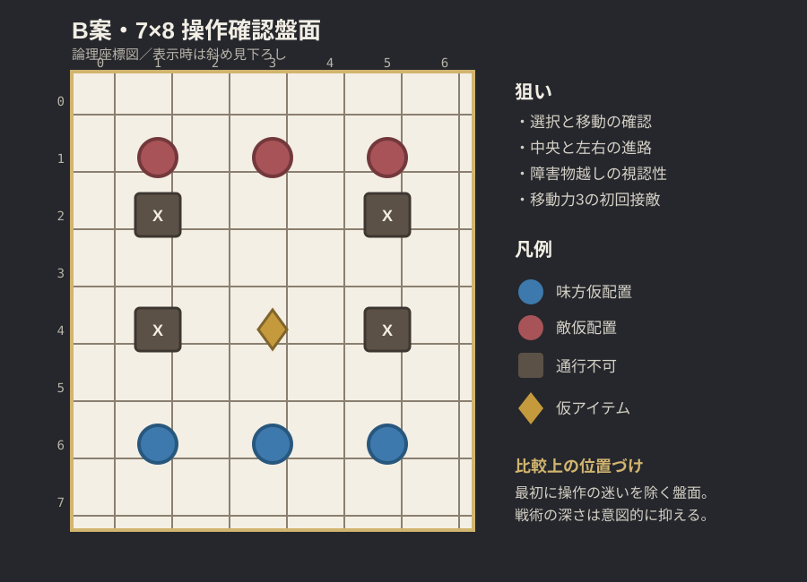
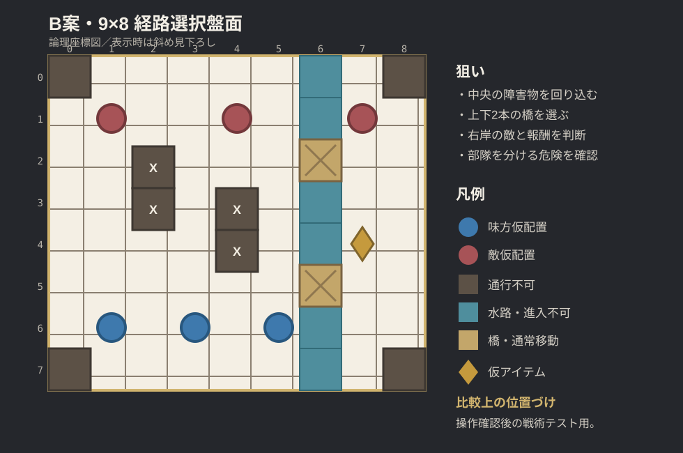

# B視点用・論理盤面比較（2026-09-24）

> **区分: ブラウザ試作向け**
> 正方形表示のB視点用に作った白地図であり、Unityの2:1アイソメトリック画像仕様ではない。中央路、迂回路、橋、水路、報酬配置の比較知見は再利用する。現行仕様は [`UNITY_ISOMETRIC_MAP_PRODUCTION_GUIDE_2026-09-26.md`](UNITY_ISOMETRIC_MAP_PRODUCTION_GUIDE_2026-09-26.md) を参照する。

## 状態

- 比較用の仮案
- 非シナリオ
- 既存ゲームコードへの反映なし
- 正式な地形効果、高低差、遮蔽は未使用
- 現行の移動力3、上下左右移動、`wall`／`void`相当の通行不可を前提とする

斜め見下ろしのB視点を採用しても、バランス設計は正方形の論理座標で行う。これにより、背景の遠近感に左右されず、移動距離と射程を確認できる。

## 7×8：操作確認盤面

### 目的

- マス選択、移動、攻撃、待機を迷わず実行できるか確認する
- B視点で障害物の占有マスを読み取れるか確認する
- 移動力3で、初回接敵までの距離が長すぎないか確認する

### 仮配置

- 味方：`(1,6)`、`(3,6)`、`(5,6)`
- 敵：`(1,1)`、`(3,1)`、`(5,1)`
- 通行不可：`(1,2)`、`(5,2)`、`(1,4)`、`(5,4)`
- 仮アイテム：`(3,4)`

### 評価

- 長所：画面が読みやすく、操作上の問題を切り分けやすい
- 短所：左右がほぼ対称で、戦術的な選択は少ない
- 用途：B視点と基本操作の初回検証

## 9×8：経路選択盤面

### 目的

- 中央の障害物を左右どちらから回るか選ばせる
- 右側の水路と2本の橋で、部隊を分ける判断を作る
- 右岸の敵とアイテムに向かう価値を検証する
- B視点で水路、橋、通行不可を見間違えないか確認する

### 仮配置

- 味方：`(1,6)`、`(3,6)`、`(5,6)`
- 敵：`(1,1)`、`(4,1)`、`(7,1)`
- 中央障害物：`(2,2)`、`(2,3)`、`(4,3)`、`(4,4)`
- 水路：`x=6`のうち、橋を除く全マス
- 橋：`(6,2)`、`(6,5)`
- 仮アイテム：`(7,4)`
- 四隅：通行不可

### 評価

- 長所：最短ルート、迂回、部隊分割、報酬回収を一度に試せる
- 短所：UIや操作に問題がある段階では、原因の切り分けが難しい
- 用途：7×8で基本操作を確認した直後の戦術テスト

## 推奨する試験順

1. 7×8でマス選択、移動、攻撃、待機を確認する
2. B視点で手前の障害物がユニットを隠さないか確認する
3. 9×8で中央ルートと橋ルートの選択を確認する
4. 単一の正解ルートになっていないか、3回以上プレイして確認する
5. その後にA視点への補助切替を検討する

## 合格条件案

- 最初の操作説明なしでも、対象マスを大きく誤選択しない
- 味方・敵・通行不可・移動可能マスを一目で区別できる
- 9×8では、少なくとも2種類の有効な初手が存在する
- アイテム取得が常に正解にも、常に損にもならない
- B視点のまま主要操作を完了でき、A視点が必須にならない
- UIを重ねても重要な橋、敵、目的地点が常時確認できる

## 未確定事項

- 地形による防御・回避補正
- 水路へ進入できる兵種
- 橋の破壊・封鎖
- 射線と遮蔽
- 高低差の戦闘補正
- 正式な勝敗条件
