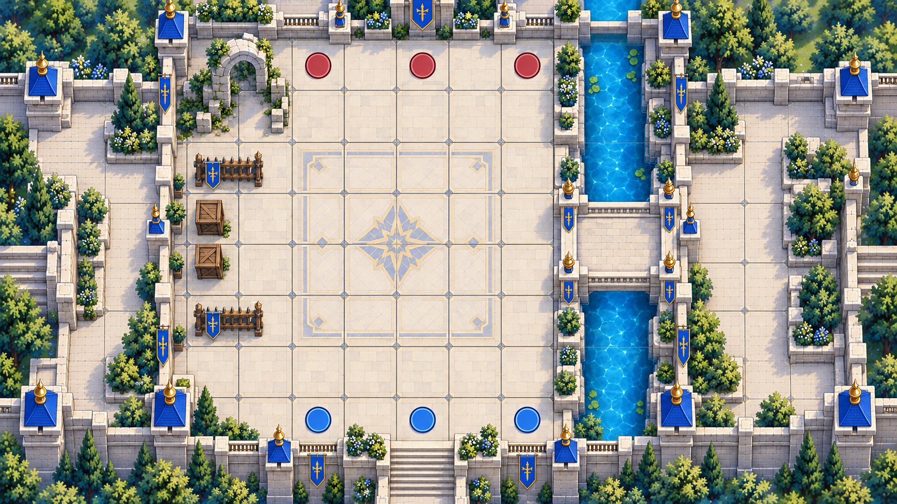
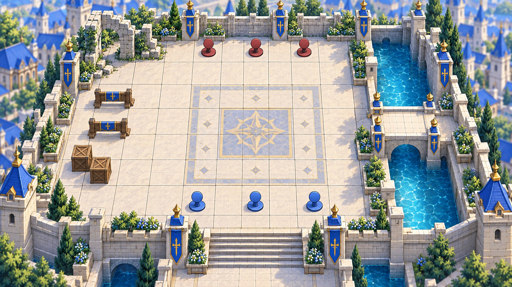
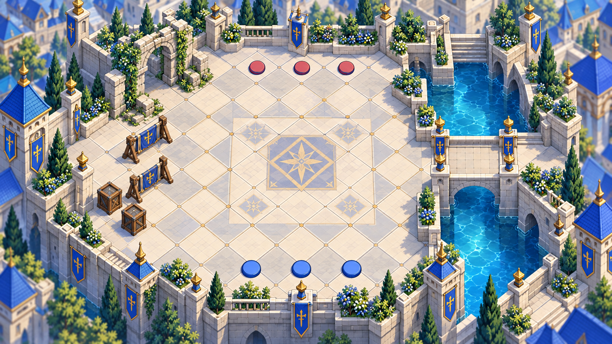

# 戦闘マップ視点比較（2026-09-24）

> **区分: 旧案・比較記録**
> 2026-09-24時点ではB案を初期標準としたが、2026-09-26にUnity版をC案系の2:1アイソメトリック、1マス128×64pxで進めることが決まった。本文と画像は判断過程と長短の記録として残す。現行仕様は [`UNITY_ISOMETRIC_MAP_PRODUCTION_GUIDE_2026-09-26.md`](UNITY_ISOMETRIC_MAP_PRODUCTION_GUIDE_2026-09-26.md) を参照する。

## 文書の位置づけ

- 状態：**初期検証方針を決定済み**
- 採用範囲：初期開発ではB案を標準視点として使用する
- 将来候補：A案への視認性補助切替、C案を用いた演出・鑑賞視点
- シナリオとの接続：未実施
- 対象：非シナリオの9×8戦術・UI検証マップ
- 画像：画像生成による方向性確認用。タイル配置や建築形状を確定する資料ではない

## 比較条件

3案は、次の共通条件で生成した。

- アルストロ王都たたき台を参考にした白石、青、鈍い金、水路、植栽
- 中央に訓練広場
- 右側に水路と橋
- 左側に訓練障害物と木箱
- 下側に味方を示す青いマーカー3個
- 上側に敵を示す赤いマーカー3個
- UI、文字、正式キャラクター、シナリオ要素は含めない

生成画像には配置の細かなぶれがあるため、盤面の公平な戦術比較には使用しない。今回はカメラ角度、マスの読みやすさ、世界観表現の比較に限定する。

## A：真上視点

### 長所

- マス境界と障害物の占有範囲が最も明確
- スマホでタップする位置を判断しやすい
- 現在の正方形グリッド、移動範囲、射程計算をそのまま活かしやすい
- 地形データと表示の食い違いを起こしにくい

### 短所

- 建物の高さや王都の壮麗さを表現しにくい
- 城壁、橋、階段が平面的に見えやすい
- 既存の王都コンセプトとの見た目の差が大きい

### 向いている用途

- 操作性と戦術性を最優先する場合
- 初期のシステム検証
- 狭い屋内、地下迷宮、盤面情報が多いマップ

## B：斜め見下ろし＋正方格子

### 長所

- 正方形グリッドを維持しつつ、壁、橋、水路、階段の立体感を出せる
- 王都コンセプトと現行の戦闘システムの中間に位置する
- マス、ユニット、背景の区別が比較的つけやすい
- 高低差が未実装でも、まず見た目だけ段差を試せる

### 短所

- 手前の壁や植栽がユニットを隠す可能性がある
- 画面手前と奥でマスの見かけ上の大きさが変わる
- 前景を透過・非表示にする仕組みが必要になる可能性がある

### 向いている用途

- 本作の第一候補
- 城、街、橋、森など世界観を見せたいマップ
- 現行ロジックを大きく変更せず、見栄えを強化したい場合

## C：2:1アイソメトリック

### 長所

- 王都、水路、城壁、高低差を最も印象的に見せられる
- 高所と低所の関係を一枚の画面で表現しやすい
- 世界観への没入感と画面の独自性が強い

### 短所

- 菱形マスへのタップ座標変換が必要
- 現在の正方形盤面表示や範囲表示を作り直す部分が多い
- 壁の裏、橋の下、段差付近でユニットを見失いやすい
- 専用タイルと高さ順の描画管理が必要

### 向いている用途

- 視点と操作を含めてシステムを作り直せる場合
- 高低差をゲームの中心的な戦術にする場合
- 制作量より画面の独自性を優先する場合

## 比較評価

| 項目 | A：真上 | B：斜め＋正方格子 | C：アイソメ |
|---|---:|---:|---:|
| マスの読みやすさ | 5 | 4 | 3 |
| スマホでの選択しやすさ | 5 | 4 | 3 |
| 世界観表現 | 3 | 5 | 5 |
| 高低差表現 | 2 | 4 | 5 |
| 現行システム流用 | 5 | 4 | 2 |
| 素材制作の軽さ | 5 | 3 | 2 |

5が最も有利。2026-09-24の原作者確認により、まずは操作性・バランスを優先し、**B：斜め見下ろし＋正方格子を初期開発の標準視点として採用**する。

これは、すべてのマップを将来にわたってB案へ固定する決定ではない。A案は盤面が分かりにくい場面の補助視点、C案は将来の演出・鑑賞視点として保留する。

## B案の技術方針

- 内部データは正方形グリッドのまま維持する
- 地面、障害物、ユニット、前景、範囲表示を別レイヤーにする
- 手前の壁や樹木は、選択中ユニットを隠す場合のみ薄くする
- タップ判定は地面のマスを基準にし、背景絵の形状には依存させない
- 高低差の能力補正は、システム仕様が決まるまで追加しない
- 最初の検証では地形を `通常床`、`通行不可`、`水路`、`橋` の4種類に限定する

## 次の制作工程

1. B案を基準に、7×8と9×8の白地図を作る
2. 盤面上の占有マス、通行不可、進軍ルートを座標で固定する
3. 仮ユニットでスマホ横画面の操作性を確認する
4. 移動・攻撃・危険範囲の読みやすさを調整する
5. B案が安定してから、A案への補助切替を試作する
6. C案への移行は、操作性と端末性能を確認した後の別段階とする
7. 地形仕様が決まってから、正式なタイル・背景素材の制作へ進む

## 画像生成プロンプト記録

使用方式：Codex組み込み画像生成

### 共通指定

アルストロ王都コンセプトを建築・配色の参考、戦闘UIコンセプトを盤面の読みやすさとユニット縮尺の参考として使用。白石、青、鈍い金、水路、植栽を用いた、シナリオ非依存の9×8検証マップ。中央訓練広場、右側の水路と橋、左側の障害物と木箱、下側の青マーカー3個、上側の赤マーカー3個。16:9、盤面全体表示、文字・HUD・ロゴ・透かしなし。

### 差分指定

- A：90度真上、遠近法なし、正方形グリッド、背の高い壁を低い輪郭へ簡略化
- B：約35度の浅い斜め見下ろし、内部は正方形グリッド、前景の遮蔽を最小化
- C：2:1菱形グリッド、固定アイソメトリック視点、地形をアイソメ軸へ統一

A案は初回出力のみ縦横比が狭かったため、内容と真上視点を維持したまま左右を自然に拡張し、B・C案と同じ1672×941の横長構図へ再生成した。
