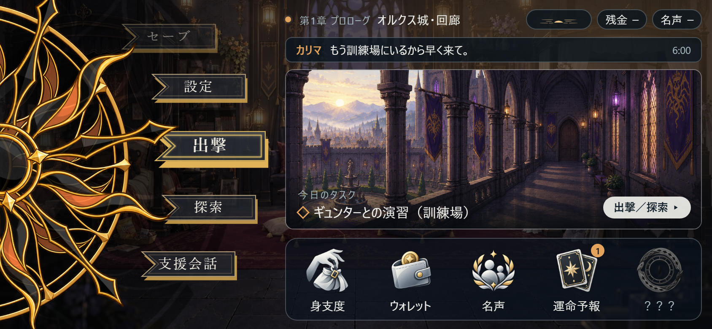
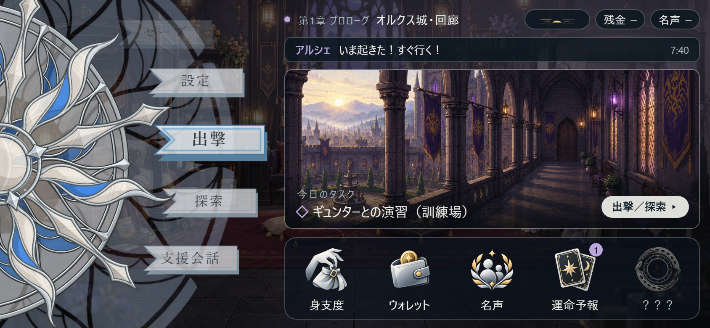

# 「アルシェとカリマの携帯端末」をメニューにするなら（総合担当の案）

日付: 2026-10-08 / 総合担当（Claude Code）
状態: **アイデア**（原作者の発案で、レビュー `MENU_APP_UI_REVIEW_2026-10-08.md` に添える案。Codex の試作は変えていない。採用は原作者とメニュー担当が決める）
見本: `menu_proposal_claude_2026-10-08/proposal.html`（静的サーバーで開く。`?owner=karima` でカリマの端末）。太陽盤・コマンド・アプリのアイコンは Codex の試作の素材をそのまま使っている。壁紙とマップの窓の絵は、今ある背景を借りた仮。

| アルシェの端末 | カリマの端末 |
|---|---|
|  |  |

## 考え方: 「メニューの画面」ではなく「二人が毎日使っている端末」

プレイヤーがメニューを開くたびに、**二人の持ち物を覗いている**感じにする。そのために、次の3つを大事にする。

1. **画面そのものが端末**。スマホで遊ぶとき、手に持っているスマホが二人の端末になる。画面の中にもう一つ端末の枠は描かない（レビューの高2。枠を描くと横幅の約23%を使い、字が読めなくなる）。PC の大きい画面だけ、外側に枠を飾るのはあり。
2. **持ち主が分かる**。アルシェとカリマで、同じ部品のまま「持ち主の色」と「壁紙」と「知らせの相手」が変わる。
3. **物語の今が一目で分かる**。章・場所・時間帯・今日のタスク・届いた知らせ。シナリオに「携帯端末の通知音で起きる」「本日のタスクには…」「運命予報のβ版を入れてもらう」とあるので、それをそのままメニューの役目にする。

## 画面の組み立て（844×390 の基準。左の太陽盤とコマンドは今のまま）

右側を上から4段にする。

| 段 | 中身 | 今の試作との違い |
|---|---|---|
| ① 状態の帯 | 持ち主の色の点・章・場所／時間帯のアイコン・残金・名声 | 残金と名声をアプリのタイルから出して、帯の小さな札に。字は13〜14px（スマホで約10px以上）。アプリのタイルは名前だけになり、字を大きくできる |
| ② 知らせ | 「カリマ　もう訓練場にいるから早く来て。」のような一行。押すと全文 | 新しい。シナリオの端末のメッセージ（プロローグ1-1）をここに出す。物語の入口になる |
| ③ マップの窓 | 今の章・場所の絵。下に「今日のタスク」（＝今の目的）、右下に「出撃／探索」 | 窓を少し大きく（494×190）。シナリオの「タスク」はここで見せる（タスク用のアプリは増やさない） |
| ④ アプリのドック | 身支度・ウォレット・名声・運命予報・？？？（アイコン58px＋名前14px） | 名前だけにして字を大きく。新しいことがあるアプリに小さな数字（例: 運命予報に「1」＝今月の予報が来た）。謎のアプリは、解放前は暗い影だけ（ドックの枠は5つのまま） |

## 持ち主の色と壁紙

- 色は**二人の本棚の花**からとった（`背景/双子の部屋/` の本棚の絵）。アルシェ＝橙の花（#e3a35c）、カリマ＝藤の花（#b9a6dc）。UI 全体の色ではなく、「持ち主の印」の一色だけに使う（点・知らせの名前・タスクの印・新着の数字・壁紙のうっすらした光）。
- 太陽盤は、今の試作の「操作キャラ」の切り替えで、アルシェは金と橙、カリマは銀と青になる。それに合わせた。
- 壁紙は見本では二人の部屋を暗くしたもの。本番の案:
  - アルシェ: 好きな少年漫画風の百年戦争もの（脇役の格好いい相棒など）の表紙。
  - カリマ: A・マーロウ版の絵本の挿絵（勇者リングホルム）。
  - どちらもシナリオ1-2の二人の好みの対比（`シナリオプロローグ1-2` の備考）をそのまま見せられる。壁紙は背景の制作に入れる（携帯端末の背景制作の候補）。

## 文字の大きさ（レビューの高1への答え）

見本の大きさ（844基準）: 場所 14px、札 13px、知らせ 13.5px、タスク 16px、アプリ名 14px。スマホ横（画面いっぱい、縮小なし〜0.9倍）で、どれも約12px以上になる。

## 物語とのつながり（あとで Unity でつなぐもの）

| 見せるもの | どこから |
|---|---|
| 章・場所 | 探索の今の場所（配置表・2Dの場所の名前） |
| 時間帯 | 場所の見え方（朝・昼・夕方・夜）。時刻の数字は出さない（方針どおり）。知らせの「6:00」も、出すなら「朝」のような言い方に変える（見本は分かりやすさのために数字にしている） |
| 知らせ | シナリオの区分「ゲーム内メッセージ」の行。届いた順に一覧、最新の一行をホームに |
| 今日のタスク | シナリオの「目的」（例: 目的「訓練場へ向かう」）。セーブにも入れる |
| 新着の数字 | 運命予報の今月の文が新しくなった、など。読んだらセーブに記録 |
| 謎のアプリ | 解放したかをセーブに記録。解放前はドックに影だけ |

## 原作者の案（2026-10-08）: 時遊びのあとの知らせと運命予報

状態: **アイデア**（原作者の発案。細かい所は未定）

- **メッセージ（二人のやり取り）は、百年戦争の時代（過去）に飛ばされたあとは使えない**。プロローグのあいだだけ。
- 第1章「時遊び」でタイムスリップしたあとは、知らせの段に**タスクの表示**と、**武器屋や飯屋のセールのお知らせが、なぜか流れてくる**。
- **運命予報**は、その章の重要な局面のヒント。章や局面ごとに表示（文）が変わるアプリ。

総合担当から足せそうなこと（どれも原作者が決める）:

| こと | 案 |
|---|---|
| 状態の帯 | 過去に飛んだあとは、通信の印が「圏外」になる。それでもセールの知らせは届く（「なぜか」が目で分かる） |
| 知らせの段の切り替え | プロローグ: 人からのメッセージ（持ち主の色の名前）。時遊びのあと: 送り主の名前のない知らせ（タスク・セール）。同じ段のまま、中身の種類だけ変える |
| セールの知らせ | 物語の飾りだけにするか、本当にその店が安くなる（遊びに効く）かは、店・お金の仕様と一緒に決める |
| 運命予報 | 文が変わったら、アイコンに新着の数字。章の始めと、重要な局面の前に変わる。読んだかはセーブに記録 |
| 作り | 知らせは「種類（メッセージ／タスク／セール）・本文・出す条件（章・場所・フラグ）」の表にする。シナリオの表の区分「ゲーム内メッセージ」と同じ形で書けるようにする |

原作者の答え（2026-10-08）:

- 時遊びのあとの知らせは、**謎の存在が送っている**。中身はゲームの仕組みに効く知らせ（例: 武器屋と道具屋がセール中／飯屋のイベントで支援値を上げやすい／遭遇戦でレアな敵が出る）。
- **セールは本当にその店が安くなり、遊びに効く**（飾りではない）。
- ヘンリーとラディンが作ったのは**運命予報β版のアプリ**だけ（謎の知らせとは別）。

→ 知らせは「その期間だけ効く、ゲームの仕組みの補正（イベント）」として作る。表の形の案: 種類（セール／飯屋のイベント／遭遇戦／タスク）・本文・出す条件（章・場所・フラグ）・効く間（例: 次の戦闘まで、この章のあいだ）・効き目（店の値引きの割合、支援値の上がり方、遭遇戦の出現の表）。店・支援・遭遇戦の仕組みはまだないので、それぞれを作るときにこの表へつなぐ。

## メニュー担当（Codex）への提案のまとめ

- 太陽盤・コマンド・アイコンの意匠は変えずに、右側の並べ方だけを変える案。今の試作の「上にアプリ、真ん中にマップ」を、「上に状態と知らせ、真ん中にマップ、下にドック」へ。
- 試すなら、`menu-apps-preview.html` とは別のページにして、旧ページ・今のホームを壊さない。
- 文字の大きさ、残金・名声を帯へ出すこと、知らせの段を作ることは、どれも見た目の判断なので、原作者に見本を見比べてもらってから。

## 原作者に選んでもらうこと

1. 画面の中に端末の枠を描くか（描かない／PC だけ描く／いつも描く）。
2. 知らせの段（二人のやり取りが見える）を入れるか。
3. 持ち主の色と壁紙で、アルシェの端末とカリマの端末を分けるか。
4. 今日のタスクをマップの窓に出すか。
